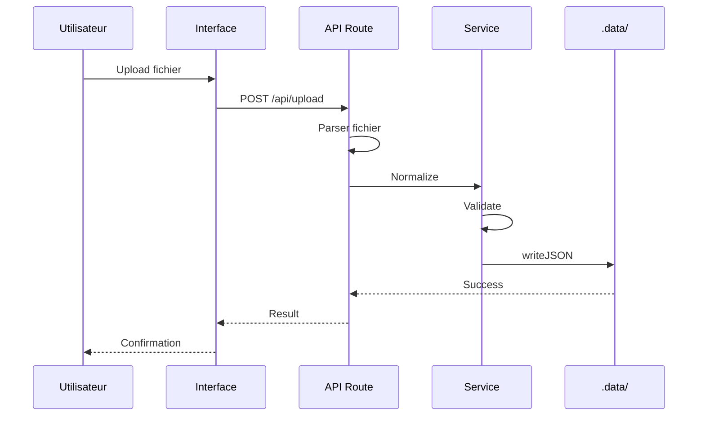
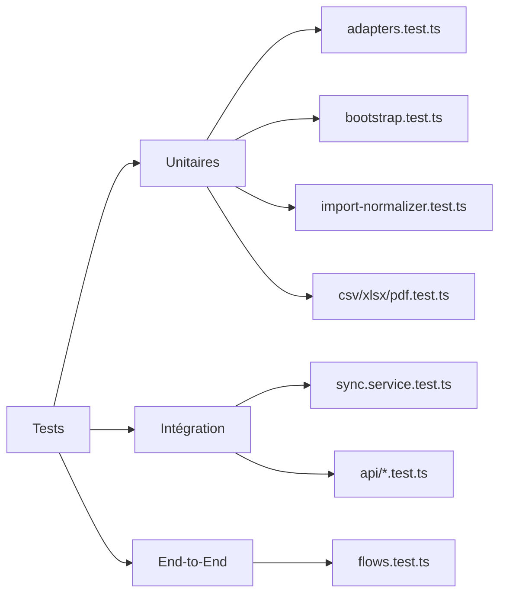

# Architecture de NexaFlow

## Vue d'ensemble

NexaFlow est une plateforme de gestion de procédures industrielles avec synchronisation de données et indexation vectorielle.

```mermaid
graph TB
    subgraph "Frontend Next.js"
        UI[Composants UI]
        Pages[Pages Dashboard]
        Hooks[Hooks Personnalisés]
    end

    subgraph "API Routes"
        InitAPI[/api/init]
        UploadAPI[/api/upload]
        SyncAPI[/api/sync]
        StructureAPI[/api/structure]
        ImportAPI[/api/admin/import/web]
    end

    subgraph "Services"
        Unified[UnifiedDatabaseService]
        Sync[SyncService]
        Import[ImportNormalizer]
        Parsers[Parsers CSV/Excel/PDF]
    end

    subgraph "Stockage"
        Local[LocalDatabaseAdapter]
        Web[WebDatabaseAdapter]
        Data[.data/]
    end

    UI --> InitAPI
    UI --> UploadAPI
    UI --> SyncAPI
    UI --> StructureAPI

    InitAPI --> Unified
    UploadAPI --> Parsers
    Parsers --> Import
    Import --> Unified

    SyncAPI --> Sync
    Sync --> Web
    Sync --> Unified

    StructureAPI --> Local

    Unified --> Local
    Unified --> Data
```

## Flux de Données



## Arborescence des Données

```mermaid
graph LR
    Root[.data/]
    Root --> Data[data/]
    Root --> Schema[schema/]
    Root --> Indexes[indexes/]
    Root --> System[system/]

    Data --> Procedures[procedures/]
    Data --> Users[users/]
    Data --> Teams[teams/]
    Data --> Media[media/]
    Data --> Reports[reports/]

    Procedures --> Proc1[{id}/]
    Proc1 --> Meta[metadata.json]
    Proc1 --> Steps[steps.json]
```

## Tests



## Stack Technique

- **Frontend** : Next.js 14, React 18, TypeScript
- **UI** : shadcn/ui, Tailwind CSS, Lucide icons
- **Backend** : API Routes Next.js
- **Stockage** : Filesystem JSON (`.data/`)
- **ORM** : Prisma 7 avec PostgreSQL
- **Parsing** : xlsx, papaparse, pdf-parse
- **Tests** : Vitest
