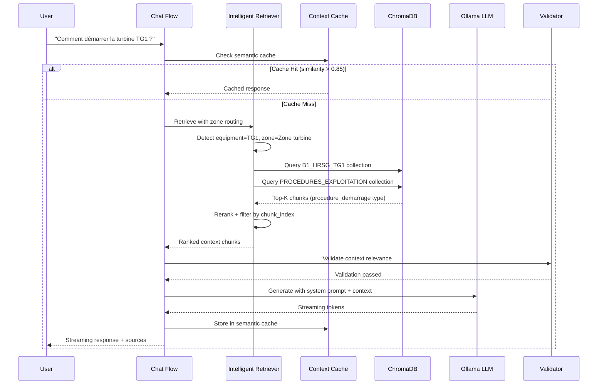

# RAG & AI Chat Implementation Analysis Report
## ETAPE-B-CCP Application — `docs/src` vs Production `src/`

**Date:** 2026-09-28  
**Scope:** Complete analysis of Retrieval-Augmented Generation (RAG) and AI chat architecture in `C:\ahmed\ETAPE-B-CCP\app\docs\src`  
**Comparison Baseline:** Production code in `C:\ahmed\ETAPE-B-CCP\app\src\`

---

## 1. Executive Summary

The `docs/src` directory contains a **research-grade, production-ready RAG and AI chat system** designed for industrial documentation (power plant procedures, technical manuals, maintenance guides). The architecture is significantly more advanced than the production `src/` implementation, which remains a lightweight Tauri desktop bridge.

### Key Characteristics of `docs/src`

| Dimension | docs/src Implementation | Production src/ Implementation |
|-----------|------------------------|--------------------------------|
| **Vector Database** | Zone-based ChromaDB with 12+ specialized collections | None (delegated to Tauri backend) |
| **Embeddings** | Dual-mode: local Xenova/transformers (CPU) + Ollama | None (handled by Tauri backend) |
| **Caching** | Semantic cache + LLM response cache + DragonMemory compression | None |
| **Chunking** | 9-phase pipeline: structure-aware → semantic refinement → late chunking | None |
| **Retrieval** | Multi-source intelligent retriever with zone routing, nominal search, technical code extraction | Basic `ask_local_rag` / `search_local_rag` |
| **Agentic Layer** | Task planner, executor, toolformer, hierarchical planner, demonstration learner | None |
| **Validation** | Context validator, chunk validator, HAZOP-style sequence validator | None |
| **Vision RAG** | TensorFlow.js + MobileNet + ChromaDB VISION collection | None |
| **Learning** | RAG learning loop storing lessons in MEMOIRE_EPISODIQUE | None |
| **Deployment** | Web app (Next.js) with full client-side AI stack | Tauri desktop app only |

### Bottom Line

`docs/src` represents a **complete, self-contained AI platform** that could operate independently of the Tauri backend. The production `src/` is a thin client that assumes all AI processing happens server-side or via Tauri commands. The `docs/src` implementation is **technically superior** but appears to be in an experimental/documentation phase, while `src/` is the stable production codebase.

---

## 2. Mermaid Architecture Diagram

```mermaid
graph TB
    subgraph "User Interface Layer"
        ChatUI["Chat Flow (chat-flow.ts)"]
        VisionUI["Vision Search Hook"]
        VoiceUI["Voice + Vision Workflow"]
    end

    subgraph "Orchestration Layer"
        Orchestrator["Elite 32 Orchestrator"]
        TaskPlanner["Task Planner (MCP decomposition)"]
        TaskExecutor["Task Executor (retries, timeouts)"]
        PredictiveEngine["Predictive Engine"]
        DemonstrationLearner["Demonstration Learner"]
    end

    subgraph "RAG Core Layer"
        IntelligentRetriever["Intelligent Retriever<br/>Zone routing + Nominal search"]
        SemanticRAGStrategy["Semantic RAG Strategy<br/>7 retrieval modes"]
        RAGLearningLoop["RAG Learning Loop"]
        ContextValidator["Context Validator"]
        ChunkValidator["Chunk Validator"]
    end

    subgraph "Vector Store Layer"
        ChromaDBManager["ChromaDB Manager"]
        ChromaDBManager --> ZoneA["A0_DIVERS"]
        ChromaDBManager --> ZoneB["B0_AUXILIAIRES"]
        ChromaDBManager --> ZoneB1["B1_HRSG_TG1"]
        ChromaDBManager --> ZoneC["C0_DIVERS"]
        ChromaDBManager --> VisionCol["VISION collection"]
        ChromaDBManager --> MemoCol["MEMOIRE_EPISODIQUE"]
    end

    subgraph "Embedding Layer"
        LocalEmbeddings["Local Embeddings<br/>Xenova/all-MiniLM-L6-v2"]
        OllamaEmbeddings["Ollama Embeddings<br/>nomic-embed-text"]
        EmbeddingConfig["Embedding Config<br/>Auto-detection"]
    end

    subgraph "Cache Layer"
        SemanticCache["Semantic Cache<br/>DragonMemory compression"]
        LLMCache["LLM Response Cache<br/>Prompt normalization + TTL"]
        CompressionEngine["Compression Engine<br/>768→64 dims TF.js"]
    end

    subgraph "Document Processing Layer"
        DocumentProcessor["Document Processor<br/>9-phase pipeline"]
        OCRService["OCR Service<br/>OCR.space API"]
        InvertedIndex["Inverted Index Service"]
    end

    subgraph "LLM Layer"
        OllamaLLM["Ollama LLM<br/>Local inference"]
        Streaming["Streaming Response"]
    end

    ChatUI --> Orchestrator
    VisionUI --> ChromaDBManager
    VoiceUI --> Orchestrator

    Orchestrator --> TaskPlanner
    Orchestrator --> IntelligentRetriever
    Orchestrator --> ContextValidator
    Orchestrator --> Streaming

    TaskPlanner --> TaskExecutor
    TaskExecutor --> Toolformer["Toolformer-Local"]

    IntelligentRetriever --> ChromaDBManager
    IntelligentRetriever --> SemanticRAGStrategy
    IntelligentRetriever --> LocalEmbeddings
    IntelligentRetriever --> OllamaEmbeddings

    SemanticCache --> CompressionEngine
    SemanticCache --> LocalEmbeddings
    LLMCache --> OllamaLLM

    DocumentProcessor --> OCRService
    DocumentProcessor --> ChromaDBManager
    DocumentProcessor --> InvertedIndex
    DocumentProcessor --> EmbeddingConfig

    ChromaDBManager --> OllamaEmbeddings
    OllamaLLM --> Streaming
    Streaming --> ChatUI

    style ChatUI fill:#e1f5ff
    style Orchestrator fill:#fff3e0
    style IntelligentRetriever fill:#f3e5f5
    style ChromaDBManager fill:#e8f5e9
    style SemanticCache fill:#fff8e1
    style DocumentProcessor fill:#fce4ec
    style OllamaLLM fill:#e0f7fa
```



---

## 3. Detailed Component Analysis

### 3.1 Document Processing Pipeline (`document-processor.ts`)

The `DocumentProcessor` implements a **9-phase ingestion pipeline**:

| Phase | Name | Description |
|-------|------|-------------|
| 1 | **Extraction** | Multi-format: PDF (pdf-parse), OCR (OCR.space API), Office (mammoth/xlsx), Archives (adm-zip), CAD, binary |
| 2 | **Structure-Aware Chunking** | Section detection via regex (Markdown headers, Roman numerals, numbered lists, tables) |
| 3 | **Semantic Refinement** | Max-min splitting (MAX=1500, MIN=300 chars) with sentence-boundary awareness |
| 4 | **Late Chunking** | Document-level embedding via Ollama for context preservation across chunks |
| 5 | **Metadata Enrichment** | Auto-detection of docType, sectionType, industrial entities (TG1, CR2, turbines, pumps) |
| 6 | **Validation Filtering** | Optional filtering by `validChunksOnly` indices from pre-validation |
| 7 | **Collection Routing** | Auto-assignment to ChromaDB collections based on path keywords |
| 8 | **Final Metadata** | Version extraction, MIME types, category/subcategory from path structure |
| 9 | **Indexing** | Batched upsert to ChromaDB with retry logic + automatic inverted index update |

**Industrial Entity Detection:**
- Equipment: TG1, TG2, TV, CR1, CR2, ALTERNATEUR, COMPRESSEUR, CONDENSEUR, POMPE HP/BP
- Zones: Salle de contrôle, Zone turbine, Zone chaudière, Zone auxiliaires, Extérieur
- Profiles: chef_bloc_TG1, operateur_TV, chef_quart, superviseur, maintenance, securite, qualite, environnement

### 3.2 ChromaDB Zone-Based Schema (`chromadb-schema.ts`)

The vector store uses **12 specialized collections** organized by industrial zone:

```typescript
type ZoneType =
  | 'A0_DIVERS'
  | 'B0_AUXILIAIRES'
  | 'B1_HRSG_TG1'
  | 'B2_HRSG_TG2'
  | 'C0_DIVERS'
  | 'D0_SURCHAUFFE'
  | 'D1_RECHAUFFE'
  | 'E0_CONDE_AERO'
  | 'E1_CONDE_REFROID'
  | 'F0_ALIMENTATION'
  | 'G0_ACIER'
  | 'H0_CABLES';
```

Each zone has:
- Custom chunking strategy (e.g., `chunk_size: 800`, `chunk_overlap: 150`)
- Dedicated embedding model (e.g., `nomic-embed-text`, `all-MiniLM-L6-v2`)
- Specific metadata fields (e.g., `pupitre`, `sousysteme`, `tolerance_economique`)

### 3.3 Intelligent Retriever (`intelligent-retriever.ts`)

The `IntelligentRetriever` is the **core retrieval engine** with multiple strategies:

| Strategy | Use Case |
|----------|----------|
| **Zone Routing** | Directs queries to relevant industrial zones based on equipment/zone detection |
| **Nominal Search** | Standard vector similarity search with configurable topK |
| **Technical Code Extraction** | Extracts and prioritizes technical codes (e.g., `P-1234`, `V-5678`) |
| **Metadata Filtering** | Filters by equipment, zone, pupitre, document type |
| **Hybrid Search** | Combines vector + inverted index for lexical precision |

**Retrieval Modes (from `semantic-rag-strategy.ts`):**
1. `list` — enumerate items
2. `step` — procedural steps
3. `definition` — term definitions
4. `detail` — detailed explanations
5. `comparison` — compare items
6. `cause_effect` — causal relationships
7. `full_document` — complete document retrieval

### 3.4 Semantic Cache & Compression (`semantic-cache.ts`, `compression-engine.ts`)

**DragonMemory Innovation:**
- Uses TensorFlow.js autoencoder to compress 768-dim embeddings → 64-dim
- Enables storing 10x more cached embeddings in memory
- Similarity threshold: 0.85 cosine similarity for cache hits
- Local embedding service: Xenova/all-MiniLM-L6-v2 via WebAssembly (<30ms latency)

**LLM Response Cache (`llm-cache.ts`):**
- Prompt normalization (whitespace, case, punctuation)
- TTL-based expiration
- Disk persistence via JSON files
- Cache hit/miss statistics

### 3.5 Chat Flow Orchestration (`chat-flow.ts`)

The `ChatFlow` class orchestrates the complete RAG pipeline:

```
User Query → Intent Detection → Retrieval Strategy Selection
    ↓
Intelligent Retriever (zone routing + vector search)
    ↓
Context Validation (relevance, hallucinations, coverage)
    ↓
Prompt Construction (system prompt + context + history)
    ↓
LLM Generation (Ollama streaming)
    ↓
Post-processing (source attribution, mindmap enrichment)
    ↓
Response Streaming to UI
```

### 3.6 Agentic Layer

| Component | Purpose |
|-----------|---------|
| **Task Planner** | Decomposes complex queries into MCP tool calls with critical path estimation |
| **Task Executor** | Executes with retries, timeouts, and reversible execution support |
| **Toolformer-Local** | Tool usage without fine-tuning via function calling |
| **Hierarchical Planner** | Multi-level validation with parent-child task relationships |
| **Predictive Engine** | Proactive suggestions based on pattern analysis |
| **Demonstration Learner** | Learns from user demonstrations to automate workflows |

### 3.7 Vision RAG (`vision-rag.ts`, `vision-rag.service.ts`)

- TensorFlow.js + MobileNet for feature extraction
- ChromaDB `VISION` collection for image embeddings
- Hybrid search: vision similarity + text metadata
- MLLM (Multimodal LLM) re-ranking
- React hooks: `useVisionSearch`, `useVoiceVisionWorkflow`

### 3.8 Validation Layer

| Validator | Purpose |
|-----------|---------|
| **Context Validator** | Validates LLM responses against retrieved context (relevance, hallucinations, coverage) |
| **Chunk Validator** | Pre-indexing validation (similarity, key terms, compression ratio) |
| **Sequence Validator** | HAZOP-style validation for industrial action plans |

### 3.9 Learning Loop (`rag-learning-loop.ts`)

- Stores lessons in `MEMOIRE_EPISODIQUE` collection
- Captures: query, retrieved chunks, LLM response, user feedback, corrections
- Enables continuous improvement of retrieval and generation quality

---

## 4. Data Flow for Typical Query

### Scenario: Operator asks "Comment démarrer la turbine TG1 ?"



### Detailed Flow Steps

1. **Query Reception**: User submits "Comment démarrer la turbine TG1 ?"
2. **Cache Lookup**: Semantic cache checks for similar queries using compressed embeddings
3. **Entity Detection**: IR detects `TG1` equipment, `Zone turbine`, `procedure_demarrage` intent
4. **Zone Routing**: Queries `B1_HRSG_TG1` (TG1-specific) and `PROCEDURES_EXPLOITATION` (general procedures)
5. **Vector Search**: ChromaDB returns top-K chunks with metadata filtering
6. **Reranking**: Semantic RAG strategy applies `step` mode for procedural queries
7. **Context Validation**: Validates chunks are relevant, no hallucinations, adequate coverage
8. **Prompt Construction**: System prompt + retrieved chunks + conversation history
9. **LLM Generation**: Ollama generates response with streaming
10. **Post-processing**: Source attribution, mindmap enrichment, learning loop storage
11. **Response Delivery**: Streaming tokens to UI with final sources

---

## 5. Strengths and Weaknesses

### Strengths

| Aspect | Strength |
|--------|----------|
| **Architecture** | Modular, zone-based design perfectly suited for industrial documentation |
| **Offline Capability** | Full local embeddings + local LLM = works without internet |
| **Performance** | DragonMemory compression enables 10x more cached embeddings; local embeddings <30ms |
| **Robustness** | 9-phase document processing with OCR fallback, retry logic, validation layers |
| **Industrial Fit** | Equipment/zone/profile detection, HAZOP validation, procedural search modes |
| **Multimodal** | Vision RAG with TensorFlow.js + ChromaDB VISION collection |
| **Learning** | Built-in learning loop for continuous improvement |
| **Flexibility** | Dual embedding modes (local + Ollama), multiple retrieval strategies |

### Weaknesses

| Aspect | Weakness |
|--------|----------|
| **Complexity** | Extremely complex for a documentation project; high maintenance burden |
| **Production Readiness** | `docs/src` appears experimental; production `src/` doesn't use this stack |
| **Scalability** | ChromaDB in browser/Node has limits; no distributed vector store support |
| **Testing** | No visible test coverage for RAG components in `docs/src` |
| **Documentation** | Heavy French logging but limited English documentation for international teams |
| **Vision RAG** | TensorFlow.js MobileNet is lightweight but less accurate than CLIP or modern vision models |
| **Ollama Dependency** | Requires local Ollama server; not suitable for pure client-side deployment |
| **Chunking Heuristics** | Structure-aware chunking relies on regex patterns; may miss complex document layouts |

---

## 6. Comparison with Production `src/`

### 6.1 Production `src/` RAG Architecture

The production code uses a **minimalist Tauri bridge approach**:

| Component | Production Implementation | docs/src Implementation |
|-----------|---------------------------|-------------------------|
| **RAG Entry Point** | `askLocalRag()` — single Tauri invoke | `ChatFlow` — full orchestration class |
| **Streaming** | Event-based (`rag-stream-token`, `rag-stream-done`) | Server-Sent Events via Ollama |
| **Vectorization** | `triggerLocalVectorization()` — Tauri command | `DocumentProcessor` — 9-phase pipeline |
| **Consistency** | `checkVectorizationConsistency()` — basic report | `ChunkValidator` + `ContextValidator` |
| **Search** | `searchLocalRag()` — topK + directory filter | `IntelligentRetriever` — zone routing + 7 strategies |
| **Storage** | Tauri backend (likely SQLite + Python) | ChromaDB (client-side) |
| **Embeddings** | Handled by Tauri backend | Xenova/transformers + Ollama (dual-mode) |
| **Caching** | None | Semantic cache + LLM cache + DragonMemory |

### 6.2 Key Differences

**Production (`src/`) Philosophy:**
- Thin client, thick backend
- Rely on Tauri/Rust for performance-critical operations
- Simple API surface: `askLocalRag`, `searchLocalRag`, `triggerLocalVectorization`
- Desktop-only (Tauri dependency)
- No client-side AI processing

**docs/src Philosophy:**
- Full-stack client-side AI
- Web-first (Next.js) with optional Tauri compatibility
- Sophisticated preprocessing, retrieval, and validation
- Offline-capable with local models
- Research/experimental focus with industrial domain adaptation

### 6.3 Integration Opportunities

| Opportunity | Description |
|-------------|-------------|
| **Hybrid Deployment** | Use `docs/src` for web users, `src/` for desktop users |
| **Backend Migration** | Port `docs/src` RAG pipeline to Tauri Rust backend for production |
| **Progressive Enhancement** | Start with `src/` minimal RAG, enhance with `docs/src` features |
| **Shared Models** | Reuse industrial entity detection and zone routing in production |

### 6.4 Recommendation

The `docs/src` implementation is **technically superior** but appears to be a **research/documentation prototype**. The production `src/` is stable but limited. A pragmatic approach would be:

1. **Short-term**: Keep `src/` as production, use `docs/src` as reference for enhancements
2. **Medium-term**: Migrate key `docs/src` innovations (zone routing, semantic cache, validation) to production
3. **Long-term**: Consider `docs/src` as the foundation for a unified web+desktop RAG platform

---

## Appendix A: File Inventory

### Core RAG Files (`docs/src/`)
```
docs/src/
├── ai/
│   ├── flows/
│   │   └── chat-flow.ts                    # Main orchestration
│   ├── rag/
│   │   ├── intelligent-retriever.ts        # Core retriever
│   │   ├── intelligent-retriever_head.ts   # Header variant
│   │   ├── config/
│   │   │   └── rag.config.ts               # Centralized config
│   │   └── rag-learning-loop.ts            # Learning loop
│   ├── vector/
│   │   ├── chromadb-manager.ts             # ChromaDB wrapper
│   │   └── chromadb-schema.ts              # Zone-based schema
│   ├── cache/
│   │   ├── semantic-cache.ts               # Semantic cache
│   │   ├── compression-engine.ts           # DragonMemory TF.js
│   │   └── local-embeddings.ts             # Xenova embeddings
│   ├── agent/
│   │   ├── task-planner.ts                 # MCP task decomposition
│   │   └── task-executor.ts                # Execution with retries
│   ├── actions/
│   │   ├── toolformer-local.ts             # Local tool usage
│   │   ├── hierarchical-planner.ts         # Hierarchical planning
│   │   ├── predictive-engine.ts            # Proactive suggestions
│   │   └── demonstration-learner.ts        # Learning from demos
│   ├── validation/
│   │   ├── context-validator.ts            # LLM response validation
│   │   ├── chunk-validator.ts              # Pre-indexing validation
│   │   └── sequence-validator.ts           # HAZOP validation
│   └── vision/
│       └── vision-rag.ts                   # Vision-based RAG
├── cache/
│   └── llm-cache.ts                        # LLM response cache
└── lib/
    └── document-manager/
        └── document-processor.ts           # 9-phase ingestion
```

### Production RAG Files (`src/`)
```
src/
├── services/
│   ├── rag-stream.ts                       # Tauri streaming bridge
│   ├── local-rag.ts                        # Tauri RAG commands
│   └── conversation-store.ts               # Conversation state
└── lib/tauri/
    └── env.ts                              # Tauri environment detection
```

---

## Appendix B: Technology Stack

### docs/src
| Layer | Technology |
|-------|------------|
| **Frontend** | Next.js, React, TypeScript |
| **Vector DB** | ChromaDB (client-side) |
| **Embeddings** | Xenova/transformers (WebAssembly), Ollama |
| **LLM** | Ollama (local inference) |
| **Compression** | TensorFlow.js (autoencoder) |
| **OCR** | OCR.space API |
| **PDF** | pdf-parse |
| **Office** | mammoth, xlsx |
| **Archives** | adm-zip |
| **Image** | sharp |

### Production src/
| Layer | Technology |
|-------|------------|
| **Frontend** | Next.js, React, TypeScript |
| **Desktop** | Tauri (Rust backend) |
| **Vector DB** | Likely SQLite + Python backend (not in src/) |
| **LLM** | Handled by Tauri backend |

---

*Report generated by Kilo — Comprehensive analysis of RAG and AI chat implementation in ETAPE-B-CCP application.*
