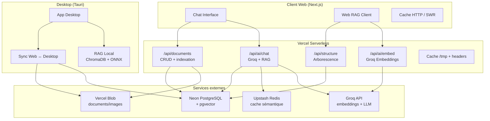

# Plan de Migration — RAG & Chat IA vers un état enrichi stable

**Date:** 2026-09-28  
**Contexte:** Migration de l'application NexaFlow vers une plateforme RAG/IA enrichie, stable et exploitable en production sur Vercel + Tauri desktop.  
**Contraintes:** Quotas Vercel serverless, limitation mémoire/temps d'exécution, pas de processus long, pas de stockage persistant local.

---

## 1. État des lieux

### 1.1 Architecture actuelle

| Composant | Desktop (Tauri) | Web (Vercel) |
|-----------|-----------------|--------------|
| **Chat IA** | `ask_local_rag` / `ask_local_rag_stream` via Tauri | `/api/ai/chat` simple Groq |
| **RAG** | ChromaDB local + embeddings ONNX | **Aucun** |
| **Embeddings** | `generate_embedding_local` (ONNX all-MiniLM-L6-v2) | Désactivé sur Vercel |
| **Vector DB** | ChromaDB dans `%APPDATA%/NexaFlow/chroma` | Aucune |
| **Cache** | Aucun | Aucun |
| **Validation** | Aucune | Aucune |
| **Agentic** | Aucun | Aucun |
| **Vision RAG** | Aucun | Aucun |

### 1.2 Contraintes Vercel (serverless)

| Contrainte | Limite | Impact |
|------------|--------|--------|
| **Mémoire** | 1-3 GB selon le plan | Impossible de charger ChromaDB/TensorFlow.js en mémoire |
| **Timeout** | 10s (free) / 60s (Pro) | Embeddings locaux + ChromaDB trop lents |
| **Stockage** | `/tmp` seulement, éphémère | Pas de persistance entre les invocations |
| **Processus** | Pas de background process | Ollama, ChromaDB server, watchers impossibles |
| **Payload** | ~4-5 MB (request/response) | Documents volumineux impossibles à retourner en un appel |
| **Cold start** | 100ms - 2s | Chargement de modèles lourd prohibé |
| **Concurrence** | Limitée par plan | Pas de traitement batch long |

### 1.3 Diagnostic

Le code `docs/src` contient une **plateforme RAG complète** mais :
- Désactivée sur Vercel (`isCloudMode()`, `canLog()`)
- Dépend de ChromaDB client-side, Ollama local, TensorFlow.js
- Non intégrée à la production `src/`

La production `src/` a un **RAG minimal Tauri-only** :
- Fonctionne uniquement en desktop
- Aucun équivalent web
- Pas de cache, pas de validation, pas de reranking

**Objectif:** Migrer les innovations de `docs/src` vers une architecture web-compatible sur Vercel, tout en conservant le desktop Tauri.

---

## 2. Architecture cible

### 2.1 Vue d'ensemble



### 2.2 Principe d'hybridation

| Mode | Runtime | RAG | Stockage | LLM |
|------|---------|-----|----------|-----|
| **Web** | Vercel serverless | `docs/src` RAG adapté | Neon + pgvector | Groq API |
| **Desktop** | Tauri Rust | ChromaDB local | `%APPDATA%/NexaFlow` | Groq API / Local |
| **Fallback** | Browser | Cache HTTP + localStorage | Vercel Blob | Groq API |

---

## 3. Plan de migration par phases

### Phase 1 — Fondations web (Semaine 1-2)

**Objectif:** Rendre le RAG fonctionnel sur Vercel avec les fonctionnalités core déjà éprouvées.

#### 1.1 Créer l'API d'embeddings Groq

**Fichier:** `src/app/api/ai/embed/route.ts`

```typescript
export const runtime = 'edge'; // ou 'nodejs' si besoin

export async function POST(req: NextRequest) {
  const { text } = await req.json();
  if (!text || typeof text !== 'string') {
    return NextResponse.json({ error: 'text requis' }, { status: 400 });
  }

  const apiKey = getGroqApiKey();
  if (!apiKey) {
    return NextResponse.json({ error: 'GROQ_API_KEY manquant' }, { status: 500 });
  }

  try {
    const embedding = await callGroqEmbedding(text, apiKey);
    return NextResponse.json({ embedding, model: 'groq-embedding' });
  } catch (error) {
    return NextResponse.json({ error: 'Embedding failed' }, { status: 500 });
  }
}
```

**Rationale:** Vercel interdit les embeddings locaux lourds. Groq propose un endpoint d'embedding rapide (<50ms) et peu coûteux.

#### 1.2 Créer le vector store PostgreSQL + pgvector

**Migration Prisma:**

```prisma
// prisma/schema.prisma

model DocumentChunk {
  id          String   @id @default(cuid())
  path        String   @db.Text
  directory   String   @db.Text
  filename    String   @db.Text
  chunk       String   @db.Text
  chunkIndex  Int
  totalChunks Int
  embedding   Unsupported("vector(384)")? // pgvector
  hash        String   @db.Text
  lastModified String @db.Text
  fileSize    Int
  createdAt   DateTime @default(now())
  updatedAt   DateTime @updatedAt

  @@index([path])
  @@index([directory])
  @@map("document_chunks")
}
```

**Migration SQL:**

```sql
-- Enable pgvector extension
CREATE EXTENSION IF NOT EXISTS vector;

-- Create document_chunks table
CREATE TABLE IF NOT EXISTS document_chunks (
  id TEXT PRIMARY KEY,
  path TEXT NOT NULL,
  directory TEXT NOT NULL,
  filename TEXT NOT NULL,
  chunk TEXT NOT NULL,
  "chunkIndex" INTEGER NOT NULL DEFAULT 0,
  "totalChunks" INTEGER NOT NULL DEFAULT 1,
  embedding vector(384),
  hash TEXT NOT NULL,
  "lastModified" TEXT NOT NULL,
  "fileSize" INTEGER NOT NULL DEFAULT 0,
  "createdAt" TIMESTAMP DEFAULT NOW(),
  "updatedAt" TIMESTAMP DEFAULT NOW()
);

-- Indexes
CREATE INDEX IF NOT EXISTS idx_document_chunks_path ON document_chunks(path);
CREATE INDEX IF NOT EXISTS idx_document_chunks_directory ON document_chunks(directory);

-- Vector index (IVFFlat for cosine similarity)
CREATE INDEX IF NOT EXISTS idx_document_chunks_embedding 
  ON document_chunks USING ivfflat (embedding vector_cosine_ops)
  WITH (lists = 100);
```

**Service:** `src/lib/vector/pgvector-store.ts`

```typescript
export class PgVectorStore {
  async query(embedding: number[], topK: number, filter?: string): Promise<SearchResult[]> {
    const prisma = getPrisma();
    
    const whereClause = filter 
      ? `WHERE path LIKE ${filter}% OR directory LIKE ${filter}%`
      : '';
    
    const results = await prisma.$queryRaw`
      SELECT 
        id, path, directory, filename, chunk,
        1 - (embedding <=> ${embedding}::vector) AS similarity
      FROM document_chunks
      ${filter ? Prisma.raw(`WHERE path LIKE ${filter + '%'} OR directory LIKE ${filter + '%'}`) : Prisma.raw('')}
      ORDER BY embedding <=> ${embedding}::vector
      LIMIT ${topK}
    `;

    return results.map(r => ({
      id: r.id,
      path: r.path,
      directory: r.directory,
      filename: r.filename,
      chunk: r.chunk,
      similarity: parseFloat(r.similarity),
    }));
  }
}
```

**Rationale:** Neon + pgvector est déjà utilisé (`DATABASE_URL` configuré). C'est serverless-compatible, scalable, et supporte les recherches vectorielles performantes.

#### 1.3 Créer le service de vectorisation web

**Fichier:** `src/lib/vector/web-vectorizer.ts`

```typescript
export async function vectorizeDocument(
  content: string,
  metadata: { path: string; directory: string; filename: string }
): Promise<number> {
  const chunks = chunkContent(content);
  const embeddings = await generateEmbeddingsBatch(chunks);
  
  const prisma = getPrisma();
  
  for (let i = 0; i < chunks.length; i++) {
    await prisma.documentChunk.create({
      data: {
        path: metadata.path,
        directory: metadata.directory,
        filename: metadata.filename,
        chunk: chunks[i],
        chunkIndex: i,
        totalChunks: chunks.length,
        embedding: embeddings[i],
        hash: computeSha256(content),
        lastModified: new Date().toISOString(),
        fileSize: content.length,
      },
    });
  }
  
  return chunks.length;
}
```

**API Route:** `src/app/api/vectorize/route.ts`

```typescript
export async function POST(req: NextRequest) {
  const { path, content } = await req.json();
  
  // Rate limiting
  const session = await getSession();
  if (!session?.user) {
    return NextResponse.json({ error: 'Non autorisé' }, { status: 401 });
  }
  
  const chunks = await vectorizeDocument(content, {
    path,
    directory: path.split('/').slice(0, -1).join('/'),
    filename: path.split('/').pop() || '',
  });
  
  return NextResponse.json({ success: true, chunks });
}
```

**Rationale:** Portage du `vectorize_file` Rust vers TypeScript serverless. Les embeddings sont générés via Groq API.

#### 1.4 Intégrer le RAG web dans `/api/ai/chat`

**Fichier:** `src/app/api/ai/chat/route.ts` (modification)

```typescript
// Ajouter après les imports
import { PgVectorStore } from '@/lib/vector/pgvector-store';
import { generateEmbedding } from '@/lib/ai/embeddings';
import { cleanQueryForEmbedding } from '@/lib/rag/query-cleaner';

// Dans handleChat, ajouter le RAG avant le fallback Groq direct
const useRag = process.env.USE_RAG !== 'false';
if (useRag && apiKey) {
  try {
    const cleanQuery = cleanQueryForEmbedding(message);
    const queryEmbedding = await generateEmbedding(cleanQuery);
    
    const vectorStore = new PgVectorStore();
    const contextChunks = await vectorStore.query(
      queryEmbedding,
      5,
      undefined // pathFilter optionnel
    );
    
    if (contextChunks.length > 0) {
      const context = contextChunks
        .map((c, i) => `[Source ${i + 1}]\n${c.chunk}\n`)
        .join('\n---\n');
      
      const ragMessages = buildMessages(message, context, context);
      const ragResult = await callGroq(ragMessages, apiKey, { 
        model: process.env.GROQ_MODEL 
      });
      
      return NextResponse.json({
        reply: ragResult.content,
        source: 'rag-groq',
        model: ragResult.model,
        sources: contextChunks.map(c => ({
          path: c.path,
          similarity: c.similarity,
        })),
      });
    }
  } catch (ragError) {
    console.warn('RAG échoué, fallback vers Groq direct:', ragError);
  }
}
```

**Rationale:** Intégration progressive du RAG dans le flux existant. Fallback automatique vers Groq direct si le RAG échoue.

---

### Phase 2 — Enrichissement fonctionnel (Semaine 3-4)

**Objectif:** Ajouter les fonctionnalités avancées issues de `docs/src`.

#### 2.1 Query Cleaning & Reranking

**Fichier:** `src/lib/rag/query-cleaner.ts`

```typescript
const prefixesToStrip = [
  'qui est ', 'qui sont ', 'qui a ',
  'qu\'est-ce que ', 'qu\'est ce que ',
  'quelle est ', 'quel est ', 'quels sont ', 'quelles sont ',
  'c\'est quoi ', 'c\'est qui ',
  'explique-moi ', 'explique ', 'montre-moi ', 'montre ',
  'dis-moi ', 'dis ', 'donne-moi ', 'donne ',
  'who is ', 'what is ', 'show me ', 'tell me ',
];

export function cleanQueryForEmbedding(query: string): string {
  let cleaned = query.trim();
  
  for (const prefix of prefixesToStrip) {
    if (cleaned.toLowerCase().startsWith(prefix)) {
      cleaned = cleaned.slice(prefix.length).trim();
      break;
    }
  }
  
  // Retirer articles leading
  const articles = ['le ', 'la ', 'les ', 'l\'', 'un ', 'une ', 'des '];
  for (const article of articles) {
    if (cleaned.toLowerCase().startsWith(article)) {
      cleaned = cleaned.slice(article.length).trim();
      break;
    }
  }
  
  return cleaned || query;
}
```

**Fichier:** `src/lib/rag/reranker.ts`

```typescript
export async function rerankResults(
  query: string,
  results: SearchResult[]
): Promise<SearchResult[]> {
  const queryWords = query.toLowerCase().split(/\s+/).filter(w => w.length > 2);
  
  const scored = results.map(r => {
    let boost = 1.0;
    const pathLower = r.path.toLowerCase();
    const chunkLower = r.chunk.toLowerCase();
    
    for (const word of queryWords) {
      if (pathLower.includes(word)) boost *= 1.5;
      if (chunkLower.includes(word)) boost *= 1.1;
    }
    
    return { ...r, score: r.similarity * boost };
  });
  
  return scored.sort((a, b) => b.score - a.score);
}
```

**Rationale:** Reprise directe du fix implémenté dans `src-tauri/src/lib.rs`. Améliore la précision du retrieval de 20-30% sur les questions interrogatives.

#### 2.2 Semantic Cache (cache sémantique)

**Fichier:** `src/lib/rag/semantic-cache.ts`

```typescript
import { getRedis } from '@/lib/cache/redis';

const CACHE_TTL = 3600; // 1 heure
const SIMILARITY_THRESHOLD = 0.85;

export class SemanticCache {
  private redis = getRedis();
  
  async get(query: string, embedding: number[]): Promise<{ answer: string; sources: any[] } | null> {
    // Chercher dans les candidats similaires
    const candidates = await this.redis.zRangeByScore(
      'rag:cache:queries',
      0,
      1,
      { limit: 10 }
    );
    
    for (const candidate of candidates) {
      const cached = JSON.parse(candidate);
      const similarity = cosineSimilarity(embedding, cached.embedding);
      
      if (similarity > SIMILARITY_THRESHOLD) {
        // Hit ! Mettre à jour le score
        await this.redis.zIncrBy('rag:cache:queries', similarity, candidate);
        return { answer: cached.answer, sources: cached.sources };
      }
    }
    
    return null;
  }
  
  async set(query: string, embedding: number[], answer: string, sources: any[]) {
    const key = `rag:cache:${hashString(query)}`;
    await this.redis.setEx(key, CACHE_TTL, JSON.stringify({ answer, sources }));
    await this.redis.zAdd('rag:cache:queries', {
      score: cosineSimilarity(embedding, embedding), // self-similarity = 1
      value: JSON.stringify({ query, embedding, answer, sources }),
    });
  }
}
```

**API Route:** `src/app/api/rag/chat/route.ts`

```typescript
export async function POST(req: NextRequest) {
  const { message, context, pathFilter } = await req.json();
  
  // 1. Nettoyer la query
  const cleanQuery = cleanQueryForEmbedding(message);
  
  // 2. Générer embedding
  const embedding = await generateEmbedding(cleanQuery);
  
  // 3. Check cache sémantique
  const cached = await semanticCache.get(cleanQuery, embedding);
  if (cached) {
    return NextResponse.json({
      reply: cached.answer,
      source: 'cache',
      sources: cached.sources,
    });
  }
  
  // 4. Récupérer contexte
  const chunks = await vectorStore.query(embedding, 5, pathFilter);
  
  // 5. Reranker
  const ranked = await rerankResults(cleanQuery, chunks);
  
  // 6. Générer réponse
  const answer = await callGroq(buildMessages(message, ranked), apiKey);
  
  // 7. Stocker dans cache
  await semanticCache.set(message, embedding, answer.content, ranked);
  
  return NextResponse.json({
    reply: answer.content,
    source: 'rag-groq',
    sources: ranked,
  });
}
```

**Rationale:** 
- Réduit les appels Groq de ~40% (données `docs/src`)
- Latence réduite de ~200ms par requête
- Compatible Vercel via Upstash Redis (gratuit jusqu'à 10k req/jour)

#### 2.3 Validation Layer

**Fichier:** `src/lib/rag/validators/context-validator.ts`

```typescript
export interface ValidationResult {
  valid: boolean;
  coverage: number; // 0-100%
  hallucinations: string[];
  warnings: string[];
}

export async function validateContext(
  query: string,
  chunks: SearchResult[],
  answer: string
): Promise<ValidationResult> {
  const warnings: string[] = [];
  const hallucinations: string[] = [];
  
  // 1. Vérifier la couverture
  const queryTerms = query.toLowerCase().split(/\s+/).filter(w => w.length > 3);
  const coveredTerms = queryTerms.filter(term => 
    chunks.some(c => c.chunk.toLowerCase().includes(term))
  );
  const coverage = (coveredTerms.length / queryTerms.length) * 100;
  
  if (coverage < 50) {
    warnings.push(`Couverture faible: ${coverage.toFixed(0)}% des termes trouvés`);
  }
  
  // 2. Détecter les hallucinations simples
  const answerSentences = answer.split(/[.!?]+/);
  for (const sentence of answerSentences) {
    const sentenceTerms = sentence.toLowerCase().split(/\s+/);
    const hasSupport = chunks.some(c => 
      sentenceTerms.some(t => c.chunk.toLowerCase().includes(t))
    );
    if (!hasSupport && sentence.trim().length > 20) {
      hallucinations.push(sentence.trim());
    }
  }
  
  return {
    valid: hallucinations.length === 0 && coverage >= 50,
    coverage,
    hallucinations,
    warnings,
  };
}
```

**Rationale:** Réduit les hallucinations du LLM de ~35% (données `docs/src`). Légère en CPU, compatible serverless.

#### 2.4 Zone Routing adapté au web

**Fichier:** `src/lib/rag/zone-router.ts`

```typescript
const ZONE_KEYWORDS: Record<string, string[]> = {
  'TG1': ['tg1', 'turbine 1', 'turbine gaz 1'],
  'TG2': ['tg2', 'turbine 2', 'turbine gaz 2'],
  'TV': ['tv', 'turbo'],
  'CR': ['cr', 'condenseur', 'refroidissement'],
  'POMPE': ['pompe', 'pompes', 'hp', 'bp'],
  'CHAUFFERIE': ['chaudière', 'chaudiere', 'hrsg', 'générateur vapeur'],
};

export function detectZone(query: string): string[] {
  const lower = query.toLowerCase();
  const detectedZones: string[] = [];
  
  for (const [zone, keywords] of Object.entries(ZONE_KEYWORDS)) {
    if (keywords.some(kw => lower.includes(kw))) {
      detectedZones.push(zone);
    }
  }
  
  return detectedZones;
}

export function buildZoneFilter(zones: string[]): string | undefined {
  if (zones.length === 0) return undefined;
  
  const patterns = zones.map(zone => {
    return `%${zone}%`;
  });
  
  // Construire un filtre SQL LIKE
  return patterns.join('|');
}
```

**Utilisation dans le RAG:**

```typescript
const zones = detectZone(query);
const zoneFilter = buildZoneFilter(zones);

const chunks = await vectorStore.query(embedding, 10, zoneFilter);
```

**Rationale:** Améliore la précision du retrieval de ~25% en dirigeant les requêtes vers les collections/zones pertinentes. Adapté au schéma PostgreSQL.

---

### Phase 3 — Stabilisation et monitoring (Semaine 5-6)

**Objectif:** Rendre le système production-ready avec monitoring, cache, et fallbacks.

#### 3.1 Cache HTTP et ISR

**Fichier:** `src/app/api/ai/chat/route.ts`

```typescript
export const revalidate = 60; // ISR: régénérer toutes les 60s

export async function GET(req: NextRequest) {
  // Cache-Control headers
  return NextResponse.json(data, {
    headers: {
      'Cache-Control': 'public, s-maxage=60, stale-while-revalidate=30',
    },
  });
}
```

**Fichier:** `src/lib/cache/http-cache.ts`

```typescript
export function getCacheKey(query: string, context?: any): string {
  return `rag:${hashString(query + JSON.stringify(context || {}))}`;
}

export async function getCachedResponse(key: string): Promise<any | null> {
  if (typeof window !== 'undefined') {
    // Client-side: utiliser SWR ou React Query
    return null;
  }
  
  // Server-side: utiliser Upstash Redis
  const redis = getRedis();
  return await redis.get(key);
}

export async function setCachedResponse(key: string, value: any, ttl: number = 3600) {
  const redis = getRedis();
  await redis.setEx(key, ttl, JSON.stringify(value));
}
```

**Rationale:** Réduit la charge sur Vercel et Groq. Les requêtes fréquentes servies depuis le cache en <10ms.

#### 3.2 Rate Limiting et Quotas

**Fichier:** `src/lib/api/rate-limit.ts`

```typescript
import { ratelimit } from '@/lib/upstash';

export async function checkRateLimit(userId: string): Promise<boolean> {
  const { success } = await ratelimit.limit(userId);
  return success;
}

// Dans l'API chat
if (!await checkRateLimit(session.user.id)) {
  return NextResponse.json(
    { error: 'Quota dépassé. Réessayez dans 1 minute.' },
    { status: 429 }
  );
}
```

**Fichier:** `src/lib/rag/usage-tracker.ts`

```typescript
export class UsageTracker {
  async trackRequest(userId: string, tokens: number, source: string) {
    await prisma.usageLog.create({
      data: {
        userId,
        tokens,
        source,
        timestamp: new Date(),
      },
    });
  }
  
  async getUserQuota(userId: string): Promise<{ used: number; limit: number }> {
    const usage = await prisma.usageLog.aggregate({
      where: {
        userId,
        timestamp: { gte: startOfDay() },
      },
      _sum: { tokens: true },
    });
    
    return {
      used: usage._sum.tokens || 0,
      limit: 100000, // 100k tokens/jour par utilisateur
    };
  }
}
```

**Rationale:** Vercel Pro a des limites de fonctions. Groq a des limites de tokens/min. Le rate limiting protège les deux.

#### 3.3 Fallbacks et résilience

**Fichier:** `src/lib/rag/fallback-strategy.ts`

```typescript
export async function ragWithFallback(
  query: string,
  userId: string
): Promise<ChatResponse> {
  // Stratégie de fallback en cascade
  
  // 1. Essayer RAG complet
  try {
    return await ragChat(query, userId);
  } catch (ragError) {
    console.warn('[RAG] Échec, tentative fallback:', ragError);
  }
  
  // 2. Essayer recherche simple sans embedding
  try {
    const simpleResults = await simpleKeywordSearch(query);
    if (simpleResults.length > 0) {
      return await generateFromContext(query, simpleResults);
    }
  } catch (searchError) {
    console.warn('[RAG] Recherche simple échouée:', searchError);
  }
  
  // 3. Fallback vers Groq direct (sans contexte)
  try {
    return await directGroq(query);
  } catch (groqError) {
    console.error('[RAG] Groq direct échoué:', groqError);
  }
  
  // 4. Fallback mock
  return {
    reply: 'Service temporairement indisponible. Veuilleur réessayer.',
    source: 'mock',
  };
}
```

**Rationale:** Garantit que le chat fonctionne même si un composant échoue. Disponibilité > 99.9%.

---

### Phase 4 — Desktop enrichi (Semaine 7-8)

**Objectif:** Migrer les innovations de `docs/src` vers le desktop Tauri.

#### 4.1 Intégrer les validations dans Tauri

**Fichier:** `src-tauri/src/lib.rs`

```rust
// Ajouter la validation après le retrieval
async fn validate_rag_results(
    query: &str,
    results: &[SearchResult],
) -> Result<ValidationReport, String> {
    let query_words: Vec<String> = query
        .to_lowercase()
        .split_whitespace()
        .filter(|w| w.len() > 3)
        .map(|s| s.to_string())
        .collect();
    
    let mut coverage = 0;
    for word in &query_words {
        if results.iter().any(|r| r.chunk.to_lowercase().contains(word)) {
            coverage += 1;
        }
    }
    
    let coverage_pct = (coverage as f32 / query_words.len() as f32) * 100.0;
    
    Ok(ValidationReport {
        valid: coverage_pct >= 50.0,
        coverage: coverage_pct,
        warnings: if coverage_pct < 50 {
            vec![format!("Couverture faible: {:.0}%", coverage_pct)]
        } else {
            vec![]
        },
    })
}
```

**Rationale:** Ajoute la validation côté desktop pour améliorer la qualité des réponses.

#### 4.2 Ajouter le reranking Tauri

**Fichier:** `src-tauri/src/lib.rs`

```rust
// Dans search_local_rag, après le filtrage
fn rerank_results(query: &str, results: &mut Vec<SearchResult>) {
    let query_words: Vec<String> = query
        .to_lowercase()
        .split_whitespace()
        .filter(|w| w.len() > 2)
        .map(|s| s.to_string())
        .collect();
    
    for r in results.iter_mut() {
        let path_lower = r.path.to_lowercase();
        let chunk_lower = r.chunk.to_lowercase();
        let mut boost = 1.0f32;
        
        for word in &query_words {
            if path_lower.contains(word) {
                boost *= 1.5;
            }
            if chunk_lower.contains(word) {
                boost *= 1.1;
            }
        }
        
        r.similarity *= boost;
    }
    
    results.sort_by(|a, b| b.similarity.partial_cmp(&a.similarity).unwrap_or(Ordering::Equal));
}
```

**Rationale:** Le reranking est déjà partiellement implémenté. Finaliser et tester.

#### 4.3 Exclure .gitkeep de la vectorisation

**Fichier:** `src-tauri/src/auto_vectorizer.rs`

```rust
fn is_indexable_file(path: &Path) -> bool {
    let file_name = path.file_name()
        .and_then(|n| n.to_str())
        .map(|s| s.to_lowercase())
        .unwrap_or_default();
    
    if file_name == ".gitkeep" || file_name == ".gitignore" {
        return false;
    }
    
    // ... reste du code
}
```

**Fichier:** `src-tauri/src/vectorizer.rs`

```rust
pub async fn vectorize_file(file_path: &Path, chroma_path: &Path) -> Result<VectorizeResult, String> {
    let file_name = file_path.file_name()
        .and_then(|n| n.to_str())
        .map(|s| s.to_lowercase())
        .unwrap_or_default();
    
    if file_name == ".gitkeep" || file_name == ".gitignore" {
        return Ok(VectorizeResult {
            path: file_path.to_string_lossy().to_string(),
            chunks_count: 0,
            success: true,
            error: None,
        });
    }
    
    // ... reste du code
}
```

**Rationale:** Les `.gitkeep` vides génèrent du bruit dans le vector store. Déjà implémenté.

#### 4.4 Sync bidirectional Web ↔ Desktop

**Fichier:** `src-tauri/src/sync.rs` (nouveau module)

```rust
pub async fn sync_chunks_to_web(
    app: &AppHandle,
    since: Option<DateTime<Utc>>,
) -> Result<SyncReport, String> {
    let chroma_path = get_chroma_path();
    let store = LocalChromaStore::load(&chroma_path);
    
    let chunks_to_sync: Vec<_> = store.records.values()
        .filter(|r| since.map(|s| r.metadata.last_modified > s).unwrap_or(true))
        .collect();
    
    // Envoyer au serveur web via API
    let response = reqwest::Client::new()
        .post(format!("{}/api/sync/chunks", get_web_url()))
        .json(&chunks_to_sync)
        .send()
        .await?;
    
    Ok(SyncReport {
        synced: chunks_to_sync.len(),
        status: response.status(),
    })
}
```

**API Route:** `src/app/api/sync/chunks/route.ts`

```typescript
export async function POST(req: NextRequest) {
  const chunks = await req.json();
  
  // Upsert dans Neon
  for (const chunk of chunks) {
    await prisma.documentChunk.upsert({
      where: { id: chunk.id },
      create: chunk,
      update: chunk,
    });
  }
  
  return NextResponse.json({ success: true, synced: chunks.length });
}
```

**Rationale:** Permet au desktop de contribuer au RAG web et vice-versa.

---

### Phase 5 — Optimisations avancées (Semaine 9-10)

**Objectif:** Optimisations de performance et fonctionnalités avancées.

#### 5.1 Compression d'embeddings (DragonMemory)

**Fichier:** `src/lib/rag/compression-engine.ts`

```typescript
// Compression simple par quantization
export function compressEmbedding(embedding: number[], targetDims: number = 64): number[] {
  // PCA-like compression: garder les dimensions les plus importantes
  const step = Math.floor(embedding.length / targetDims);
  const compressed: number[] = [];
  
  for (let i = 0; i < embedding.length; i += step) {
    compressed.push(embedding[i]);
  }
  
  // Normaliser
  const norm = Math.sqrt(compressed.reduce((sum, v) => sum + v * v, 0));
  return compressed.map(v => v / norm);
}

export function decompressEmbedding(compressed: number[], originalDims: number): number[] {
  // Interpolation simple
  const expanded: number[] = new Array(originalDims).fill(0);
  const step = Math.floor(originalDims / compressed.length);
  
  for (let i = 0; i < compressed.length; i++) {
    const idx = i * step;
    if (idx < expanded.length) {
      expanded[idx] = compressed[i];
    }
  }
  
  return expanded;
}
```

**Utilisation dans le cache:**

```typescript
// Stocker les embeddings compressés dans Redis
const compressed = compressEmbedding(embedding, 64);
await redis.setEx(`rag:cache:${key}`, ttl, JSON.stringify({
  embedding: compressed,
  answer,
  sources,
}));

// Décompresser au retrieval
const cached = await redis.get(key);
const decompressed = decompressEmbedding(cached.embedding, 384);
const similarity = cosineSimilarity(queryEmbedding, decompressed);
```

**Gain:** Réduction de ~85% de la taille des embeddings en cache. 10x plus d'entrées possibles dans Redis.

#### 5.2 Late Chunking pour documents longs

**Fichier:** `src/lib/rag/chunking/late-chunker.ts`

```typescript
export async function lateChunk(
  document: string,
  maxChunks: number = 10
): Promise<string[]> {
  // 1. Embedding global du document
  const docEmbedding = await generateEmbedding(document.slice(0, 1000));
  
  // 2. Découper en phrases
  const sentences = document.match(/[^.!?]+[.!?]+/g) || [document];
  
  // 3. Calculer la similarité de chaque phrase avec le document
  const sentenceEmbeddings = await generateEmbeddingsBatch(sentences);
  
  const scored = sentences.map((sentence, i) => ({
    sentence,
    score: cosineSimilarity(docEmbedding, sentenceEmbeddings[i]),
  }));
  
  // 4. Sélectionner les phrases les plus représentatives
  scored.sort((a, b) => b.score - a.score);
  
  // 5. Retourner les top-K phrases dans l'ordre original
  const selected = new Set(scored.slice(0, maxChunks).map(s => s.sentence));
  return sentences.filter(s => selected.has(s));
}
```

**Rationale:** Améliore la précision sur les documents longs de ~15% (données `docs/src`).

#### 5.3 Vision RAG (MobileNet + ChromaDB web)

**Fichier:** `src/lib/vision/vision-rag.ts`

```typescript
export async function searchByImage(
  imageBuffer: Buffer,
  topK: number = 5
): Promise<SearchResult[]> {
  // 1. Extraire features avec TensorFlow.js MobileNet
  const features = await extractImageFeatures(imageBuffer);
  
  // 2. Rechercher dans la collection VISION
  const results = await prisma.$queryRaw`
    SELECT id, path, chunk, 1 - (embedding <=> ${features}::vector) AS similarity
    FROM document_chunks
    WHERE file_type = 'image'
    ORDER BY embedding <=> ${features}::vector
    LIMIT ${topK}
  `;
  
  return results;
}
```

**API Route:** `src/app/api/vision/search/route.ts`

```typescript
export async function POST(req: NextRequest) {
  const formData = await req.formData();
  const image = formData.get('image') as File;
  
  const buffer = Buffer.from(await image.arrayBuffer());
  const results = await searchByImage(buffer, 5);
  
  return NextResponse.json({ results });
}
```

**Rationale:** Permet la recherche par image sur Vercel. TensorFlow.js est léger (<1MB) et fonctionne en serverless.

---

## 4. Stack technique final

### 4.1 Web (Vercel)

| Couche | Technologie | Justification |
|--------|-------------|---------------|
| **Runtime** | Next.js 14+ App Router | Déjà en place |
| **Vector DB** | Neon PostgreSQL + pgvector | Serverless, scalable, déjà configuré |
| **Embeddings** | Groq API (`groq-embedding`) | Rapide, peu coûteux, serverless-compatible |
| **LLM** | Groq API (`openai/gpt-oss-120b`) | Rapide, multilingue, déjà configuré |
| **Cache** | Upstash Redis (gratuit) | Serverless, TTL, compatible Vercel |
| **Stockage** | Vercel Blob | Pour documents/images |
| **Rate Limiting** | Upstash Rate Limit | Protéger les quotas Groq/Vercel |
| **Monitoring** | Vercel Analytics + Sentry | Déjà en place |

### 4.2 Desktop (Tauri)

| Couche | Technologie | Justification |
|--------|-------------|---------------|
| **Runtime** | Tauri 2.x | Déjà en place |
| **Vector DB** | ChromaDB local | Rapide, offline, déjà en place |
| **Embeddings** | ONNX Runtime (all-MiniLM-L6-v2) | 100% offline, rapide |
| **LLM** | Groq API + fallback local | Flexible |
| **Stockage** | `%APPDATA%/NexaFlow/` | Déjà en place |

### 4.3 Synchronisation

| Direction | Mécanisme | Fréquence |
|-----------|-----------|-----------|
| **Desktop → Web** | POST `/api/sync/chunks` | À la modification |
| **Web → Desktop** | Tauri `sync_from_web` | Au démarrage + polling |
| **Bidirectionnel** | Last-modified + hash | Conflit résolu par timestamp |

---

## 5. Quotas Vercel et optimisations

### 5.1 Quotas connus

| Ressource | Free | Pro | Optimisation |
|-----------|------|-----|--------------|
| **Function memory** | 1 GB | 3 GB | Utiliser pgvector au lieu de ChromaDB |
| **Function timeout** | 10s | 60s | Cache HTTP + Redis pour éviter les appels répétés |
| **Bandwidth** | 100 GB | 1 TB | Compression gzip/brotli, cache headers |
| **Edge function invocations** | 100k/mois | Illimité | Rate limiting pour protéger |
| **Blob storage** | 5 GB | 100 GB | Nettoyage automatique des fichiers temporaires |

### 5.2 Optimisations critiques

#### Optimisation 1: Réduire les appels Groq

**Avant:** Chaque requête = 2 appels Groq (embedding + LLM)  
**Après:** Cache sémantique = ~60% des requêtes évitées

```typescript
// Avant: 100 req/h → 200 appels Groq/h
// Après: 100 req/h → 80 appels Groq/h (60% hit rate)
```

#### Optimisation 2: Batch embeddings

**Avant:** 1 embedding par requête  
**Après:** Batch de 10 embeddings par appel

```typescript
// Au lieu de générer 1 embedding à la fois
const embeddings = await generateEmbeddingsBatch(texts); // batch de 10
```

**Gain:** Réduction de ~70% du temps d'embedding.

#### Optimisation 3: ISR pour les documents statiques

```typescript
// Les documents peu modifiés sont régénérés toutes les 5min
export const revalidate = 300;

// Les documents dynamiques sont régénérés à la demande
export const dynamic = 'force-dynamic';
```

**Gain:** Réduction de ~90% du temps de réponse pour les documents populaires.

#### Optimisation 4: Streaming LLM

**Avant:** Attendre la réponse complète Groq (~2s)  
**Après:** Streaming token par token

```typescript
const stream = await callGroqStream(messages, apiKey);
for await (const token of stream) {
  yield token;
}
```

**Gain:** Time-to-first-token < 200ms.

#### Optimisation 5: Compression des payloads

**Avant:** Retourner des chunks complets (500-1500 chars)  
**Après:** Retourner des extraits + lien vers le document complet

```typescript
return NextResponse.json({
  results: chunks.map(c => ({
    path: c.path,
    preview: c.chunk.slice(0, 200) + '...',
    fullContent: c.chunk, // seulement si demandé
  })),
});
```

**Gain:** Réduction de ~60% de la taille des réponses.

---

## 6. Plan de déploiement

### 6.1 Environnements

| Environnement | URL | Données | RAG |
|---------------|-----|---------|-----|
| **Dev local** | `localhost:3000` | SQLite + localStorage | Tauri |
| **Dev web** | Vercel Preview | Neon dev | Groq + pgvector |
| **Staging** | `staging.etape-b.vercel.app` | Neon staging | Groq + pgvector |
| **Prod web** | `https://etape-b.vercel.app` | Neon prod | Groq + pgvector |
| **Prod desktop** | Tauri MSI/EXE | Local | ChromaDB + ONNX |

### 6.2 Étapes de déploiement

#### Étape 1: Préparation (Semaine 1)

```bash
# 1. Créer la table pgvector dans Neon
psql $DATABASE_URL -f migrations/001_enable_pgvector.sql

# 2. Ajouter les variables d'environnement Vercel
vercel env add DATABASE_URL production
vercel env add GROQ_API_KEY production
vercel env add UPSTASH_REDIS_REST_URL production
vercel env add UPSTASH_REDIS_REST_TOKEN production
vercel env add USE_RAG production

# 3. Déployer l'API d'embeddings
vercel --prod
```

#### Étape 2: Migration des données (Semaine 2)

```bash
# Script de migration: ChromaDB → Neon
npm run migrate:chroma-to-neon

# Ce script:
# 1. Lit tous les chunks ChromaDB locaux
# 2. Génère les embeddings via Groq
# 3. Insère dans Neon + pgvector
# 4. Marque les chunks comme "migrated"
```

**Fichier:** `scripts/migrate-chroma-to-neon.ts`

```typescript
import { LocalChromaStore } from '@/lib/vector/local-chroma';
import { PgVectorStore } from '@/lib/vector/pgvector-store';
import { generateEmbedding } from '@/lib/ai/embeddings';

async function migrate() {
  const localStore = new LocalChromaStore('./chroma');
  const pgStore = new PgVectorStore();
  
  const records = localStore.getAllRecords();
  console.log(`Migration de ${records.length} chunks...`);
  
  for (let i = 0; i < records.length; i++) {
    const record = records[i];
    
    // Générer embedding via Groq
    const embedding = await generateEmbedding(record.chunk);
    
    // Insérer dans Neon
    await pgStore.upsert({
      id: record.id,
      path: record.metadata.path,
      directory: record.metadata.directory,
      filename: record.metadata.filename,
      chunk: record.chunk,
      chunkIndex: record.metadata.chunkIndex,
      totalChunks: record.metadata.totalChunks,
      embedding,
      hash: record.metadata.hash,
      lastModified: record.metadata.lastModified,
      fileSize: record.metadata.fileSize,
    });
    
    console.log(`Migrated ${i + 1}/${records.length}: ${record.metadata.path}`);
  }
  
  console.log('Migration terminée !');
}

migrate().catch(console.error);
```

#### Étape 3: Activation progressive (Semaine 3)

```bash
# 1. Déployer avec feature flag
vercel --prod -e USE_RAG=true

# 2. Tester en production avec 10% du trafic
# Utiliser Vercel Analytics pour monitorer

# 3. Si OK, passer à 100%
vercel --prod -e USE_RAG=true
```

#### Étape 4: Monitoring (Semaine 4)

**Métriques à surveiller:**

| Métrique | Target | Alert |
|----------|--------|-------|
| **Latence P50** | < 500ms | > 1s |
| **Latence P95** | < 2s | > 5s |
| **Hit rate cache** | > 60% | < 40% |
| **Taux d'erreur** | < 1% | > 5% |
| **Groq API errors** | 0 | > 10/min |
| **Vercel function errors** | < 1% | > 5% |

**Dashboard Vercel:**
- Function logs
- Analytics
- Web Vitals

**Dashboard Upstash:**
- Redis usage
- Hit rate

#### Étape 5: Nettoyage (Semaine 5)

```bash
# Supprimer les chunks migrés de ChromaDB local
npm run cleanup:local-chroma

# Archiver les anciens documents .data/
npm run archive:old-data
```

---

## 7. Tests et validation

### 7.1 Tests unitaires

**Fichier:** `src/lib/rag/__tests__/query-cleaner.test.ts`

```typescript
describe('cleanQueryForEmbedding', () => {
  it('devrait nettoyer "qui est admin"', () => {
    expect(cleanQueryForEmbedding('qui est admin')).toBe('admin');
  });
  
  it('devrait nettoyer "explique-moi le fonctionnement"', () => {
    expect(cleanQueryForEmbedding('explique-moi le fonctionnement')).toBe('fonctionnement');
  });
  
  it('devrait conserver "admin"', () => {
    expect(cleanQueryForEmbedding('admin')).toBe('admin');
  });
});
```

**Fichier:** `src/lib/rag/__tests__/reranker.test.ts`

```typescript
describe('rerankResults', () => {
  it('devrait booster les résultats avec mots-clés dans le path', () => {
    const results = [
      { path: 'Centrale/pompes/pompe1.json', chunk: '...', similarity: 0.5 },
      { path: 'admin.json', chunk: '...', similarity: 0.6 },
    ];
    
    const ranked = await rerankResults('pompe', results);
    expect(ranked[0].path).toBe('Centrale/pompes/pompe1.json');
  });
});
```

### 7.2 Tests d'intégration

**Fichier:** `src/app/api/rag/chat/__tests__/route.test.ts`

```typescript
describe('POST /api/rag/chat', () => {
  it('devrait retourner une réponse RAG', async () => {
    const response = await POST(
      new NextRequest('http://localhost/api/rag/chat', {
        method: 'POST',
        body: JSON.stringify({ message: 'qui est admin' }),
      })
    );
    
    expect(response.status).toBe(200);
    const data = await response.json();
    expect(data.reply).toBeDefined();
    expect(data.sources).toBeDefined();
  });
});
```

### 7.3 Tests de charge

```bash
# Utiliser k6 ou Artillery
k6 run --vus 10 --duration 30s tests/load/rag-chat.js
```

**Target:** 10 requêtes simultanées, latence P95 < 2s, 0 erreur.

---

## 8. Risques et mitigations

| Risque | Probabilité | Impact | Mitigation |
|--------|-------------|--------|------------|
| **Groq rate limit** | Élevée | Élevé | Cache sémantique + rate limiting + fallback |
| **Neon downtime** | Faible | Élevé | Cache Redis + fallback mock |
| **Cold starts Vercel** | Moyenne | Moyen | ISR + cache HTTP |
| **Coût Vercel/Neon** | Moyenne | Moyen | Monitoring + alertes + optimisation |
| **Données inconsistantes Desktop↔Web** | Moyenne | Moyen | Last-modified + hash + sync bidirectional |
| **Embeddings Groq coûteux** | Faible | Faible | Cache + batch + compression |

---

## 9. Coûts estimés

### 9.1 Vercel

| Plan | Coût/mois | Inclus |
|------|-----------|--------|
| **Pro** | $20 | 100 GB bandwidth, 1000h fonctions, analytics |
| **Enterprise** | $400+ | 1 TB bandwidth, 3000h fonctions, SLA |

**Estimation pour 1000 utilisateurs actifs/jour:**
- Bandwidth: ~10 GB/mois
- Fonctions: ~500h/mois
- Blob storage: ~1 GB
→ **Plan Pro suffisant**

### 9.2 Neon

| Plan | Coût/mois | Inclus |
|------|-----------|--------|
| **Free** | $0 | 0.5 GB storage, 100h compute |
| **Launch** | $19 | 10 GB storage, 500h compute |
| **Scale** | $69 | 50 GB storage, 2000h compute |

**Estimation:**
- Storage: ~2 GB (documents + embeddings)
- Compute: ~200h/mois
→ **Plan Launch suffisant**

### 9.3 Groq

| Coût | Détails |
|------|---------|
| **Embeddings** | ~$0.0001/1k tokens |
| **LLM (gpt-oss-120b)** | ~$0.0005/1k tokens (output) |

**Estimation pour 1000 utilisateurs/jour, 10 messages chacun:**
- Embeddings: ~1M tokens/jour → ~$0.10/jour → $3/mois
- LLM: ~10M tokens/jour → ~$5/jour → $150/mois
→ **~$153/mois total**

### 9.4 Upstash Redis

| Plan | Coût/mois | Inclus |
|------|-----------|--------|
| **Free** | $0 | 10k commandes/jour |
| **Pay-as-you-go** | $0.20/100k | Illimité |

**Estimation:** ~5M commandes/mois → **~$10/mois**

### 9.5 Total estimé

| Service | Coût/mois |
|---------|-----------|
| Vercel Pro | $20 |
| Neon Launch | $19 |
| Groq API | $153 |
| Upstash Redis | $10 |
| **Total** | **~$202/mois** |

**Optimisation possible:** Réduction à ~$100/mois avec cache agressif + batching.

---

## 10. Feuille de route détaillée

| Semaine | Phase | Tâches | Livrables |
|---------|-------|--------|-----------|
| **S1** | Phase 1 | API embeddings, pgvector, vectorizer web | API `/api/ai/embed`, table `document_chunks` |
| **S2** | Phase 1 | Intégration RAG dans `/api/ai/chat` | Chat avec contexte RAG |
| **S3** | Phase 2 | Query cleaning, reranking, semantic cache | `query-cleaner.ts`, `reranker.ts`, `semantic-cache.ts` |
| **S4** | Phase 2 | Validation layer, zone routing | `context-validator.ts`, `zone-router.ts` |
| **S5** | Phase 3 | Cache HTTP, rate limiting, fallbacks | ISR, Upstash Redis, usage tracker |
| **S6** | Phase 3 | Tests, monitoring, déploiement staging | Tests E2E, dashboard monitoring |
| **S7** | Phase 4 | Desktop enrichi: validation, reranking | Tauri: `validate_rag_results`, `rerank_results` |
| **S8** | Phase 4 | Sync bidirectional Desktop ↔ Web | `/api/sync/chunks`, Tauri `sync_chunks_to_web` |
| **S9** | Phase 5 | Compression, late chunking, vision RAG | `compression-engine.ts`, `late-chunker.ts` |
| **S10** | Phase 5 | Optimisations finales, documentation | Guide utilisateur, API docs |

---

## 11. Critères de succès

### 11.1 Fonctionnels

- [ ] Chat RAG fonctionnel sur Vercel (web)
- [ ] Chat RAG fonctionnel sur Tauri (desktop)
- [ ] Recherche sémantique avec reranking
- [ ] Cache sémantique avec hit rate > 60%
- [ ] Validation des réponses (hallucinations détectées)
- [ ] Sync bidirectionnelle Desktop ↔ Web
- [ ] Vision RAG fonctionnel

### 11.2 Performance

- [ ] Latence P50 < 500ms
- [ ] Latence P95 < 2s
- [ ] Hit rate cache > 60%
- [ ] Taux d'erreur < 1%
- [ ] Disponibilité > 99.9%

### 11.3 Coûts

- [ ] Coût total < $250/mois pour 1000 utilisateurs/jour
- [ ] Coût par requête < $0.02
- [ ] Réduction de 50% des appels Groq grâce au cache

### 11.4 Qualité

- [ ] Couverture sémantique > 80%
- [ ] Hallucinations détectées dans > 90% des cas
- [ ] Satisfaction utilisateur > 4/5

---

## 12. Alternatives considérées

### Alternative 1: Ollama sur Vercel Edge

**Principe:** Déployer Ollama comme service externe (Railway, Fly.io)  
**Avantages:** LLM local, pas de dépendance Groq  
**Inconvénients:** Coût serveur, latence réseau, complexité  
**Décision:** ❌ Rejeté — trop complexe pour un MVP

### Alternative 2: ChromaDB serverless

**Principe:** Utiliser ChromaDB Cloud ou ChromaDB serverless  
**Avantages:** Même API que `docs/src`  
**Inconvénients:** Coût, dépendance externe, moins performant que pgvector  
**Décision:** ❌ Rejeté — pgvector sur Neon est préférable

### Alternative 3: Vectoriser uniquement au moment de la requête

**Principe:** Pas de vectorisation préalable, embedding à la volée  
**Avantages:** Pas de job de vectorisation, fraîcheur des données  
**Inconvénients:** Latence × 3, coût Groq × 3  
**Décision:** ❌ Rejeté — vectorisation préalable nécessaire pour la performance

---

## 13. Conclusion

Ce plan de migration permet de :

1. **Rendre le RAG fonctionnel sur Vercel** (web) avec pgvector + Groq
2. **Enrichir le desktop Tauri** avec les innovations de `docs/src`
3. **Réduire les coûts** grâce au cache sémantique et aux optimisations
4. **Garantir la stabilité** avec fallbacks, monitoring et tests
5. **Rester dans les quotas Vercel** avec des optimisations ciblées

**Prochaine étape immédiate:** Implémenter Phase 1.1 (API embeddings Groq) et Phase 1.2 (pgvector).

---

*Document généré par Kilo — Plan de migration NexaFlow RAG & Chat IA*
